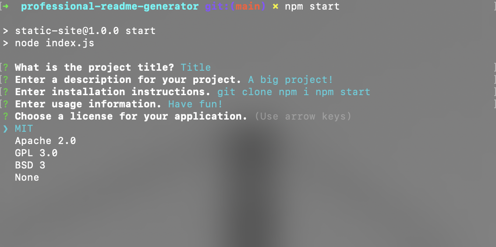

# Professional-README-Generator

A command-line application that dynamically generates a professional README.md file from a user's input using the Inquirer package.

## Motivation

This project was built to streamline the process of creating professional README files for GitHub projects.

## Why This Was Built

Creating a well-structured README is a repetitive task. This project was built to automate that process and ensure consistency across projects.

## What It Solved

This application solves the problem of spending unnecessary time manually creating README files for every new project.

## What I Learned

Through this project, I learned how to use the Inquirer package to create a command-line application and how to dynamically generate markdown files using JavaScript.

## Table of Contents

- [Features](#features)
- [How to Use](#how-to-use)
- [Usage](#usage)
- [Technologies Used](#technologies-used)
- [Local Development](#local-development)
- [Deployment Link](#deployment-link)
- [Credits & Resources](#credits--resources)
- [License](#license)

## Features

- Dynamic README generation
- User-friendly command-line interface
- Customizable project information

## How to Use

1. Clone the repository.
2. Run `npm install` to install the required packages.
3. Run `node index.js` and answer the prompts to generate your README.

## Usage

## Technologies Used

- Node.js
- Inquirer.js
- JavaScript

## Local Development

To set up this project locally for development:

1. Clone this repository.
2. Run `npm install` to install the required packages.

## Demonstration Video

[Click here to go to the demonstration video](https://youtu.be/WF1j94-s9G0)

## Credits & Resources

- [Inquirer.js](https://www.npmjs.com/package/inquirer)
- [Node.js](https://nodejs.org/)

## License

This project is open source and available under the [ISC License](LICENSE).
